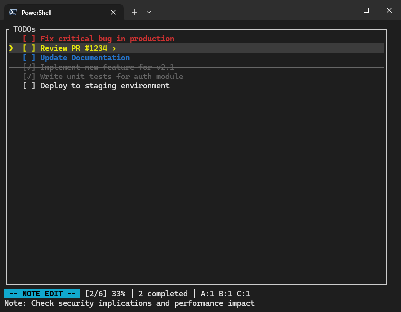

# tuido

A terminal-based todo list manager with vim-like keybindings, written in Rust.

## Overview

tuido provides a modal interface for managing todo items with priorities, notes, and completion tracking. It features fuzzy search, undo/redo functionality, and supports exporting to multiple formats.



## Installation

Build from source:

```bash
git clone https://github.com/Cod-e-Codes/tuido.git
cd tuido
cargo build --release
```

The binary will be available at `target/release/tuido`.

## Usage

Run tuido:

```bash
./tuido
```

Data is automatically saved to `~/.tuido.json`. The application loads existing todos on startup and saves changes automatically.

## Keybindings

### Navigation
- `j` / `k` - Move up/down
- `gg` - Go to first todo
- `G` - Go to last todo
- `↑` / `↓` - Arrow key navigation

### Editing
- `i` - Insert new todo
- `e` - Edit selected todo
- `x` - Toggle completion
- `dd` - Delete todo
- `o` - Open note editor
- `Esc` - Exit current mode

### Visual Mode
- `v` - Enter visual mode
- `j` / `k` - Extend selection
- `x` - Toggle selected todos
- `d` - Delete selected todos

### Search
- `/` - Start search
- `Enter` - Confirm search
- `Esc` - Clear search

### Undo/Redo
- `u` - Undo
- `Ctrl+r` - Redo

## Commands

Use `:` to enter command mode:

- `:q` - Quit (warns if unsaved)
- `:q!` - Force quit without saving
- `:w` - Save
- `:wq` - Save and quit
- `:clear` - Remove completed todos
- `:sort` - Sort by completion status
- `:sort priority` - Sort by priority
- `:!cmd` - Execute shell command
- `:write <file>` - Save to file
- `:open <file>` - Load from file
- `:export <file>` - Export to .txt or .md
- `:help` - Show help

## Features

### Priorities
Set priorities by prefixing todo text:
- `(A) High priority task`
- `(B) Medium priority task`
- `(C) Low priority task`

### Notes
Add detailed notes to any todo using the `o` key. Notes are stored with the todo and can be edited inline.

### Search
Fuzzy search supports:
- Exact text matching
- Subsequence matching
- Levenshtein distance matching

### Export Formats
- **Todo.txt**: Standard todo.txt format with priorities and completion status
- **Markdown**: Checkbox format suitable for documentation

### Undo/Redo
Full undo/redo support with up to 100 operations in history.

## Configuration

Todos are stored in JSON format at `~/.tuido.json`:

```json
[
  {
    "text": "Example todo",
    "completed": false,
    "priority": "A",
    "note": "Optional note text"
  }
]
```

## Dependencies

- `ratatui` - Terminal user interface
- `crossterm` - Cross-platform terminal manipulation
- `serde` / `serde_json` - Serialization
- `strsim` - String similarity algorithms
- `dirs` - Home directory detection
